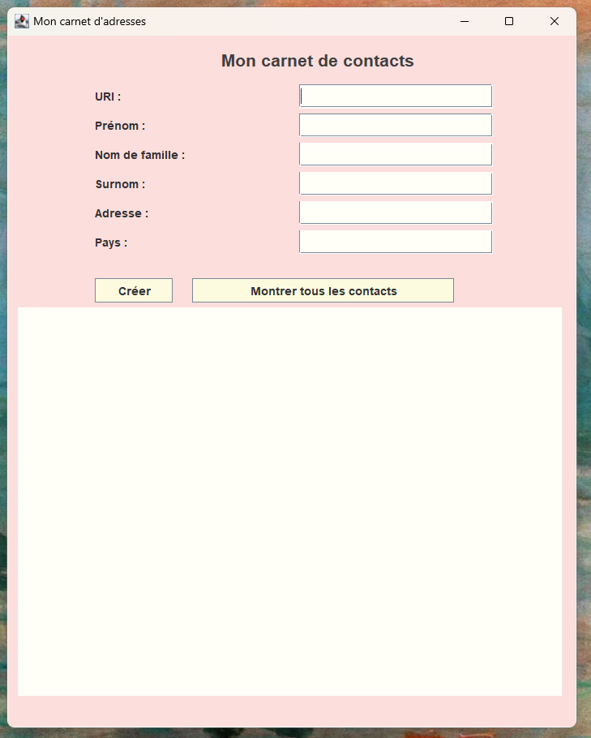
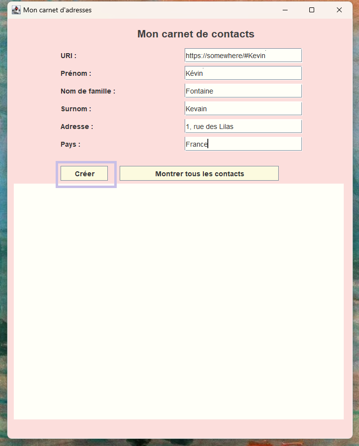
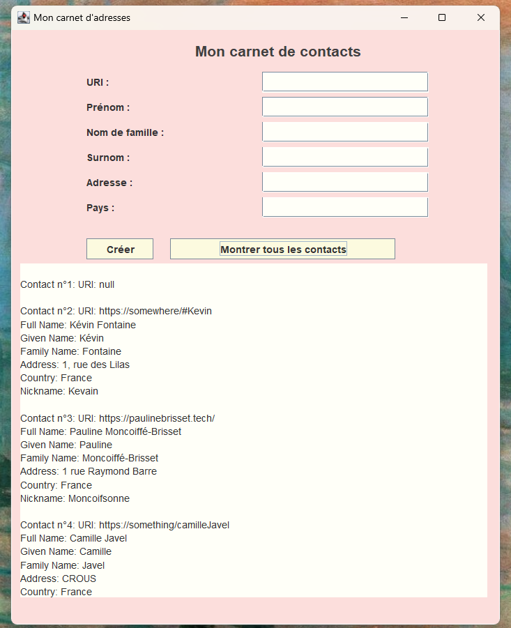

## Getting Started

University project. Practical work on semantic web using Jena and RDF to create an address book based on the Java language.

### Overview
- Homepage view


- Create a new contact


- Display a contacts notebook


## Requirements

To set up and run this Java project on your system, make sure you have [Java SE Development Kit 8 (JDK 1.8.0_381)](https://www.oracle.com/fr/java/technologies/downloads/) or a compatible version installed. You should also have followed the steps of the "Get started with Java developement" guide of Vscode.

You also need to download the [Jena framework](https://jena.apache.org/tutorials/). 

## Installing

* Clone the project repository from the Git repository

   ```bash
   git clone https://github.com/paulinebrisset/JenaAddressBookg.git
   ```

* Open the projet with vscode

* Update the `.vscode/settings.json` file to update the path to the Jena files there 

* Run the AdressBookGUI projet

